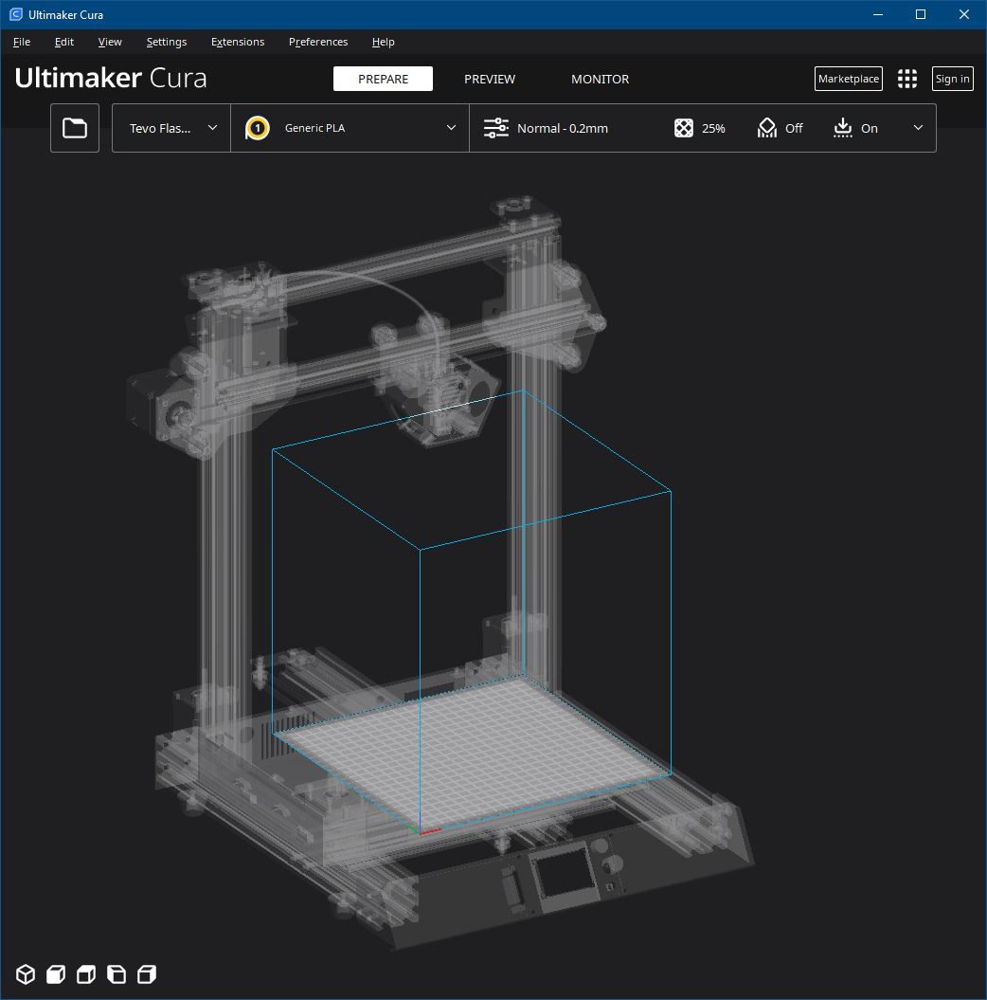
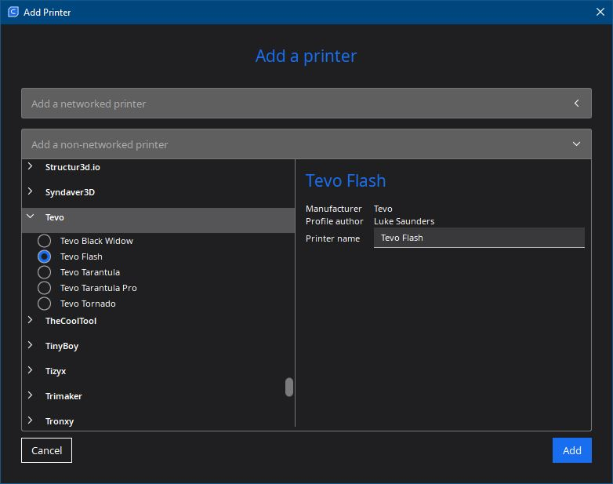

# Tevo Flash - Cura Printer Driver

---

---
## Install Driver

#### Linux
    ./import-printerdefinition <cura_path>

#### Windows
    .\Import-PrinterDefinition.ps1

---
## Cura Setup
### Add Printer
    1. Settings > Printer > Add Printer... > Add a non-networked printer
    2. Scroll down to 'Tevo'
    3. Select 'Tevo Flash'
    4. Click 'Add'

## Notes

### Tevo Flash v1.0 Firmware Defaults 
#### Acceleration
| Function  | Default |
| :-------- | :-----: |
| Accel     |  1500   |
| A-retract |  10000  |
| A-travel  |  3000   |
| Amax X    |  3000   |
| Amax Y    |  3000   |
| Amax Z    |   300   |
| Amax E    |  10000  |

#### Jerk
| Function | Default |
| :------- | :-----: |
| Vx-jerk  |   10    |
| Vy-jerk  |   10    |
| Vz-jerk  |   0.3   |
| Ve-jerk  |    5    |

#### Velocity
| Function  | Default |
| :-------- | :-----: |
| Vmax X    |   400   |
| Vmax Y    |   400   |
| Vmax Z    |   50    |
| Vmax E    |   45    |
| Vmin      |    0    |
| VTrav min |    0    |

#### Temperature
| Function | Default |
| :------- | :-----: |
| P        |  12.56  |
| I        |  0.91   |
| D        |  43.2   |
| Autotune |   150   |

#### Steppers
| Function | Default |
| :------- | :-----: |
| Xstep/mm |  80.05  |
| Ystep/mm |  80.05  |
| Zstep/mm | 399.29  |
| Estep/mm |   408   |

---
## References
https://github.com/Ultimaker/Cura/wiki/Adding-new-machine-profiles-to-Cura
